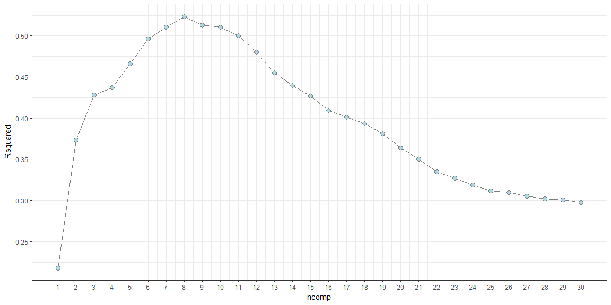
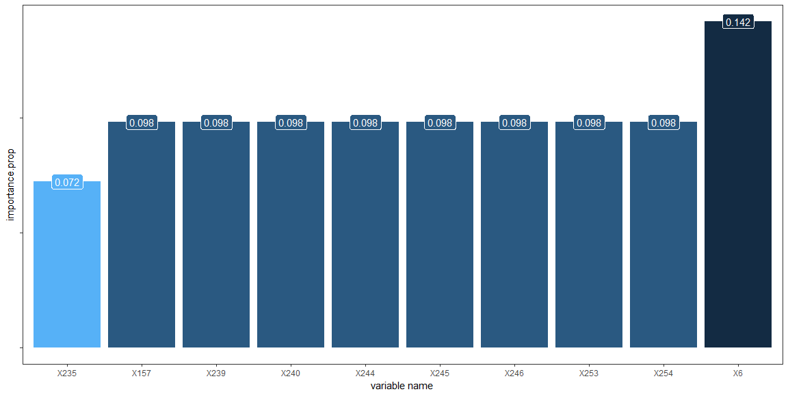

### Required packages

``` r
library(AppliedPredictiveModeling)
library(caret)
library(tidyverse)
library(pls)
library(corrplot)
```

### Load data

``` r
data(permeability)

fingData <- as_tibble(fingerprints) # Matrix to Tibble
permData <- as_tibble(permeability) # Matrix to Tibble
```

------------------------------------------------------------------------

Part 1: Data
------------

This pharmaceutical data set was used to develop a model for predicting compounds’ permeability. Permeability is the measure of a molecule’s ability to cross a membrane. The body, for example, has notable membranes between the body and brain, known as the blood–brain barrier, and between the gut and body in the intestines. These membranes help the body guard critical regions from receiving undesirable or detrimental substances. Permeability assays such as PAMPA and Caco-2 have been developed to help measure compounds’ permeability. These screens are effective at quantifying a compound’s permeability, but the assay is expensivelabor intensive. Given a sufficient number of compounds that have been screened, we could develop a predictive model for permeability in an attempt to potentially reduce the need for the assay. In this project there are 165 unique compounds; 1,107 molecular fingerprints were determined for each. A molecular fingerprint is a binary sequence of numbers that represents the presence or absence of a specific molecular substructure.

*After importing the data, We notice it contains two matrices.* 
*The matrix fingerprints contains the 1107 binary molecular predictors for the 165 compounds, while the matrix permeability contains permeability response.*

------------------------------------------------------------------------

Part 2: Pre-process the Data
----------------------------

Is there any predictors should be added or removed? Is there any transformation should be applied to the samples? How do I need to deal with missing values, if any?

### Pre-process the response data

**Firstly, explore the response distribution**

``` r
permData%>%
    ggplot()+
    geom_histogram(aes(x = permeability, y = ..density..), 
                   fill = "cornsilk", color = "grey50", bins = 20)+
    scale_x_continuous(breaks = seq(-5, 50, by = 5))
```

 
*As noted, the data is right skewed*


**The next step is to transform the response to become symmetric**

``` r
permDataTrans <- preProcess(permData, 
                            method = c("center", "scale", "YeoJohnson")) %>%
                 predict(newdata = permData) 
```

**after applying transformation, let's check the response distribution again**

``` r
permDataTrans %>%
    ggplot()+
    geom_histogram(aes(x = permeability, y = ..density..), 
                   fill = "cornsilk", color = "grey50", bins = 20)+
    scale_x_continuous(breaks = seq(-2, 2, by = .5))+
    scale_y_continuous(breaks = seq(0, .6, by = .05))
```

 
*Now, it tends to be nearly symmetric*

### Pre-process the predictors data

**Explore the predictors distribution**

But due to very large number of predictors, we explore a random sample from the predictors

``` r
set.seed(6)
fingData[, sample(1:ncol(fingData), 8)] %>%
    gather(key = "predictor", value = "value") %>%
    ggplot()+
    geom_line(aes(x = value), stat = "density", size = .8, color = "grey50")+
    facet_wrap(~predictor, nrow = 4, scales = "free")+
    theme_bw()+
    theme(panel.grid.major = element_blank())
```


**missing values**

calculate number of missing values for each predictor, and print top ten

``` r
sum.na <- function(inpt) {
    sum(is.na(inpt))
}
cbind(fingData, permDataTrans) %>%
    apply(2, sum.na) %>%
    sort(decreasing = TRUE) %>% 
    head(n = 10)
```

    ##  X1  X2  X3  X4  X5  X6  X7  X8  X9 X10 
    ##   0   0   0   0   0   0   0   0   0   0

*As the output shows, the data contains no missing values*


**Check low frequency variables and Remove near-zero varince**

``` r
length(nearZeroVar(fingerprints))
```

    ## [1] 719

``` r
fingData <- fingData[, -nearZeroVar(fingerprints)]
```
*719 near-zero variance fingerprints have been removed*


**Also, Check between predictors correlation**

``` r
set.seed(6)
fingData[, sample(1:ncol(fingData), 45)] %>%
    cor()%>%
    corrplot(order = "hclust", type = "lower", win.asp = .6)
```

 

*As noticed, there's significant relation between predictors, so we may need to perform models that not affected by these characteristics*


------------------------------------------------------------------------

Part 3: Training/Test Splitting
-------------------------------

**The code below splits the data 75% for training, and 25% for testing**

``` r
trRows <- createDataPartition(permDataTrans$permeability, 
                              p = .75, list = FALSE)

permDataTrans.train <- permDataTrans[trRows, ]
permDataTrans.test <- permDataTrans[-trRows, ]

fingData.train <- fingData[trRows, ]
fingData.test <- fingData[-trRows, ]

datatrain <- cbind(permDataTrans.train, fingData.train)
datatest <- cbind(permDataTrans.test, fingData.test)
```

------------------------------------------------------------------------

Part 4: Model tuning, Choosing optimal tuning parameter
-------------------------------------------------------

### Firstly, tuning PLS model

**Training PLS with leave-group-out cross-validation**

``` r
set.seed(1)
plsFit <- train(permeability ~ ., data = datatrain,
                method = "pls", metric = "Rsquared",
                tuneGrid = expand.grid(ncomp = 1:30),
                trControl = trainControl(method = "LGOCV"))
```

**Explore the optimal number of components which give the highest R2**

``` r
plsFit$results %>%
    ggplot(aes(x = ncomp, y = Rsquared))+ 
    geom_line(color = "grey50")+
    geom_point(shape = 21, size = 3, color = "grey50", fill = "lightblue" )+
    scale_x_continuous(breaks = 1:30)+
    scale_y_continuous(breaks = seq(0, .6, by = .05))+
    theme_bw()
```

 
*The optimal number of components is 8 at R squared value of 0.52*


**Now, let's predict the test response response using the PLS fit,** 
**and compare the correlation with the one we got from training**

``` r
permData.pls <- predict(plsFit, newdata = datatest)
caret::R2(permData.pls, datatest$permeability) 
```

    ## [1] 0.7131155
    

### Secondly, tuning elasticnet model

**Training Elastic Net with leave-group-out cross-validation**

``` r
set.seed(1)
enetFit <- train(permeability ~ ., data = datatrain,
                method = "enet", metric = "Rsquared",
                tuneGrid = expand.grid(lambda = c(0, .05, 1),
                                       fraction = seq(.05, 1, length.out = 20)),
                trControl = trainControl(method = "LGOCV"))
```


**Explore the optimal weight decay and fraction trade-off that lead to the highest R2**

``` r
    ggplot(data = enetFit$results,
           aes(x = fraction, y = Rsquared, color = as.factor(lambda)))+ 
    geom_line()+
    geom_point(aes( shape = as.factor(lambda)))+
    scale_x_continuous(breaks = seq(.05, 1, length = 20))+
    scale_y_continuous(breaks = seq(.4, .6, by = .025))+
    guides(color = guide_legend("lambda"), shape = guide_legend("lambda"))+
    theme_bw()
```

 
*The highst R2 value is 0.57 at lambda 0.05 and fraction 0.10*

**Now, let's predict the test response response using the enet fit,** 
**and compare the correlation with the one we got from training**

``` r
permData.enet <- predict(enetFit, newdata = datatest)
caret::R2(permData.enet, datatest$permeability) 
```

    ## [1] 0.7441898


Part 5: Choosing between the two models
---------------------------------------

**Using confidence interval to see if there's real diff between two resamples**

``` r
resamp <- resamples(list(PLS = plsFit, Elasticnet = enetFit))
diff(resamp)%>%
    summary()
```

    ## 
    ## Call:
    ## summary.diff.resamples(object = .)
    ## 
    ## p-value adjustment: bonferroni 
    ## Upper diagonal: estimates of the difference
    ## Lower diagonal: p-value for H0: difference = 0
    ## 
    ## MAE 
    ##            PLS    Elasticnet
    ## PLS               0.01508   
    ## Elasticnet 0.1885           
    ## 
    ## RMSE 
    ##            PLS     Elasticnet
    ## PLS                0.03231   
    ## Elasticnet 0.01321           
    ## 
    ## Rsquared 
    ##            PLS       Elasticnet
    ## PLS                  -0.04545  
    ## Elasticnet 0.0009744

*R2 difference is 0.045 with p value equals 0.0009*
*The p-value is much smaller than .05 this indicates we reject the null hypothesis* 
*and there's a real difference between the performance of the two models*

So clearly, I should choose Elastic net model as the final model for this problem.


**Plotting observed VS predicted to check how well the model works**

``` r
ggplot(data = NULL, 
       aes(x = datatest$permeability, y = permData.enet))+
    geom_jitter() + 
    geom_smooth(se = F)+
    labs(x = "observed", y = "predicted")+
    coord_fixed(xlim = c(-2, 2), ylim = c(-2, 2))
```


*Note: The near-to linear relation between observed and predicted values indecates that the model works well*


**Plot predicted VS residuals to check if any features are missed by the model**

``` r
ggplot(data = NULL, aes(x = predict(enetFit), y = resid(enetFit)))+
    geom_jitter() + 
    geom_hline(yintercept = 0, linetype = "dashed", color = "#211112")+
    coord_fixed(xlim = c(-2, 2), ylim = c(-2, 2))+
    labs(x = "predicted", y = "residuals")
```


*Note: The random cloud of points around zero with respect to y-axis with no outliers indicates that there's no missing features to capture*

Part 6: Controlling response
----------------------------

If we can control the values of the most important predictors, then we can control the values of the response

**Let's calculate the most important variables in the data for the Elastic Net model**

``` r
vi <- varImp(enetFit)$importance
topVarImp <- tibble(name = rownames(vi), importance = vi$Overall)%>%
    arrange(desc(importance))%>%
    head(n = 10) %>%
    mutate(importance.prop = importance/sum(importance))

topVarImp %>%
    ggplot(aes(x = reorder(name, importance.prop), y = importance.prop, fill = rev(importance.prop)))+
    geom_bar(stat = "identity") +
    geom_label(aes(label = round(importance.prop, 3)), color = "#ffffff", size = 4)+
    guides(fill = "none")+
    theme_bw()+
    theme(panel.grid = element_blank(), axis.text.y = element_blank())+
    labs(x = "variable name", fill = "importance prop")
```

 
We can investigate our time focusing on the top important variables, instead of focusing on all variables, and try to understand why those particular variables have a strong positive relation with the response. If we could increase their values, the response value wolud increase significantly.
